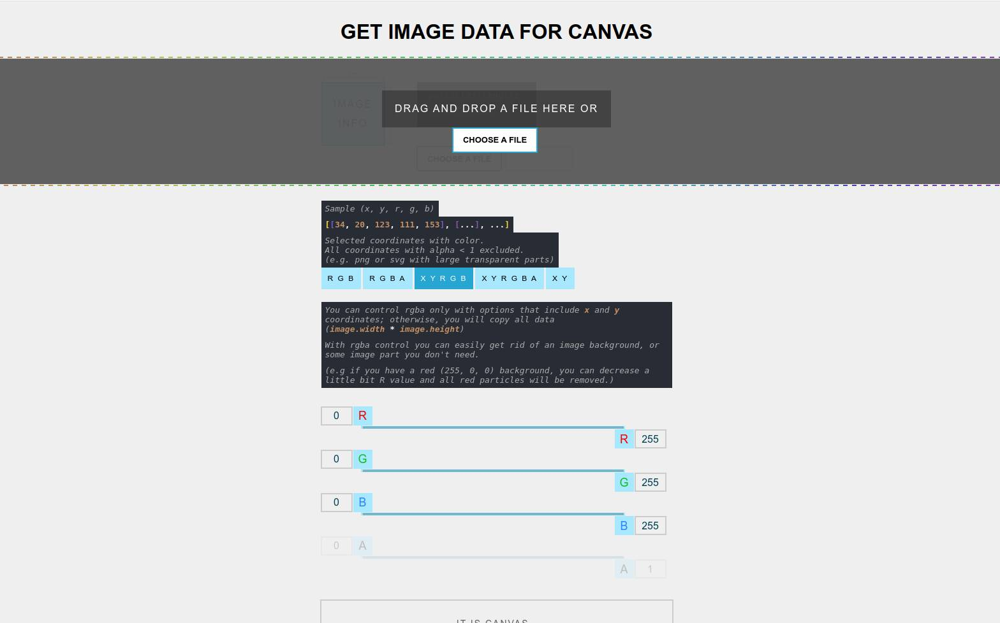

## GET IMAGE DATA TOOL
[**Visit the website**](https://malashevskyi.pp.ua/get-image-data)

You can get data from image instead of using ```context.getImageData();```

Only drawing without interaction works in 60 FPS on my computer (Ryzen 5 2600 3.4GHz) up to 5500 particles, then FPS sags.

## Contents
- [Why](#why)
- [RGBA Controls examples](#rgba-controls-examples)
- [Options](#options)
- [Particle example](#particle-example)
- [Iteration examples](#iteration-examples)



## Why
When I use `context.getImageData()` FPS sags even if I want to get `1px`. More problem if I need to get data from several images, or I use several canvases or use routing.
## RGBA Controls examples
|Example        | Solution             |
| -------------- |-----------------------------------------------------|
|remove black background | `black - (0, 0, 0)`, <br> to remove you need to set `r` or `g` or `b` more than `0`                      |
|remove white background | `white - (255, 255, 255)`, <br> to remove you need to set `r` or `g` or `b` less than `255`              | 
|remove red background   | `red - (255, 0, 0)`, <br> to remove you need to set `r` less than `255` or set `g` or `b` more than `0` | 

## Options:
|Option        |Sample                 |Description                         | 
| -------------- |-----------------------------------------------------|----------------------------------------------|
| r g b          | `[[r, g, b], [...], ...]`                   | get all coordinates `image.width * image.height`, you need to use jpg rather than png or svg; otherwise when you set:<br> ```this.color = 'rgb(${r},${g},${b})'``` <br> all transparent parts (if exist) will be black.|
| r g b a        | `[[r, g, b, a], [...], ...]`             | get all coordinates `image.width * image.height`, in case, if an image has small transparent parts then better copy all coordinates than add `x` and `y` to each particle, then when you iterate data you can create a particle if `a > 0` |
| x y  r g b     | `[[x, y, r, g, b], [...], ...]`       | get only selected coordinates with `x`, `y` and color, then you can iterate `data.length` with one loop or randomly draw some particles, <br> ALL COORDINATES WITH `alpha < 1` EXCLUDED. |
| x y  r g b a   | `[[x, y, r, g, b, a], [...], ...]` | the same as `xy rgb` but also include coordinates with `alpha < 1`, here you can control with A range which coordinates will be included.|
| x y            | `[[x, y], [...], ....]`                        |the only position of every selected pixel without color, ok if you create some text or shapes animation with the same color.|

## Particle example
  ```javascript
  class Particle {
    constructor({ x, y, r, g, b, a, width, height, color }) {
      this.x = x;
      this.y = y;
      this.color = color ? color : `rgba(${r}, ${g}, ${b}, ${a})`;
      this.width = width;
      this.height = height;
    }

    draw() {
      context.beginPath();
      context.fillStyle = this.color;
      context.rect(this.x, this.y, this.width, this.height);
      context.fill();
    }
  }
  ```
## Iteration examples
- #### Iterate `rgb` or `rgba` with two loops
    ```javascript
    import { data } from './data.js'; // your copied data 

    /* set real dimensions of your image */
    const image = {
      width: 100,
      height: 100
    }

    /* multiply x and y if you want to make big image
    with visible pixels */
    const scale = 1;

    let i = 0;
    for (let y = 0; y < image.height; y++) {
      for (let x = 0; x < image.width; x++) {
        particles.push(new Particle({
          x: x * scale,
          y: y * scale,
          r: data[i][0],
          g: data[i][1],
          b: data[i][2],
          /* rgba */
          a: data[i][3],
          /* rgb */
          a: 1,

          /* set width and height to scale, if you scale it*/
          width: scale,
          height: scale,
        }));

        i++;
      }
    }
    ```
- #### Iterate `rgb` or `rgba` with one loop
    ```javascript
    import { data } from './data.js'; // your copied data 

    /* set a real width of your image */
    const image = {
      width: 300,
    }

    /* multiply x and y if you want to make big image
    with visible pixels */
    const scale = 1;

    for (let i = 0; i < data.length; i++) {
      particles.push(new Particle({
        x: i % (image.width) * scale,
        y: Math.floor(i / image.width) * scale,
        r: data[i][0],
        g: data[i][1],
        b: data[i][2],
        /* rgba */
        a: data[i][3],
        /* rgb */
        a: 1,

        /* set width and height to scale, if you scale it*/
        width: scale,
        height: scale,
      }));
    }
    ```
- #### Iterate `xyrgb` or `xyrgba`
    ```javascript
    import { data } from './data.js'; // your copied data 

    /* multiply x and y if you want to make big image
    with visible pixels */
    const scale = 1;

    for (let i = 0; i < data.length; i++) {
      particles.push(new Particle({
        x: data[i][0] * scale,
        y: data[i][1] * scale,
        r: data[i][2],
        g: data[i][3],
        b: data[i][4],
        /* xy rgba */
        a: data[i][5],
        /* xy rgb */
        a: 1,

        /* set width and height to scale, if you scale it*/
        width: scale,
        height: scale,
      }));
    }
    ```
- #### Iterate `xy`
    ```javascript
    import { data } from './data.js'; // your copied data 

    /* multiply x and y if you want to make big image
    with visible pixels */
    const scale = 1;

    for (let i = 0; i < data.length; i++) {
      particles.push(new Particle({
        x: data[i][0] * scale,
        y: data[i][1] * scale,
        color: 'purple',
        /* set width and height to scale, if you scale it*/
        width: scale,
        height: scale,
      }));
    }
    ```